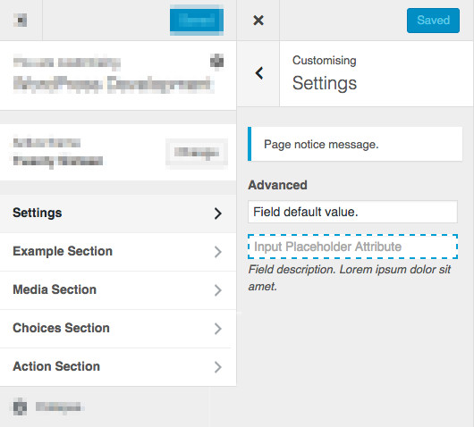

# WordPress Settings for Themes and Plugins Developers

Settings are really useful to provide an easy configuration of **themes** and **plugins** to our users within their administration panel, but the creation of settings forms often ends up in a messy and repetitive use of the great *WordPress Settings and Customizer APIs*.

This library provides a **fast, clean and easy way to generate settings pages, form sections and fields for the dashboard or the customizer**.

```php
function wm_example()
{
	$page = wm_settings_add_page( 'page_id', 'Page Title' );
	$page->add_field( 'field_name', 'Field Label', 'text', array(
		'default' => 'Field default value.'
	) );
}
add_action( 'wm_settings_pages', 'wm_example' );
```


```php
$value = wm_get_setting( 'page_id', 'field_name' );
```

## Installation

1. Download the last release
2. Unzip it into your theme or plugin
3. `require_once( 'path/to/wm-settings.php' );`

## Documentation

[Read the documentation](http://webmaestro.fr/wordpress-settings-api-options-pages/#wm-settings-doc).

## Examples

### Menus

```php
function wm_example_menus()
{
	$parent_page = wm_settings_add_page( 'parent_id', 'Parent Title', array(
		'parent'     => false,
		'title'      => 'Parent Menu',
		'capability' => 'manage_options',
		'icon_url'   => 'dashicons-wordpress',
		'position'   => '63.3'
	) );
	$child_page = wm_settings_add_page( 'child_id', 'Child Title', 'parent_id' );
}
add_action( 'wm_settings_pages', 'wm_example_menus' );
```


### Pages

```php
function wm_example_pages()
{
	$options_page = wm_settings_add_page( 'example_page', 'Page Title', 'options-general.php', array(
		'description' => 'Page description. Lorem ipsum dolor sit amet.',
		'submit'      => 'Submit Text',
		'reset'       => 'Reset Text',
		'tabs'        => true,
		'updated'     => 'Success message.'
	), 'wm_example_register' );
}
add_action( 'wm_settings_pages', 'wm_example_pages' );
```

### Fields, sections and notices


```php
function wm_example_register( $page )
{
	$page->add_field( 'advanced_example', 'Advanced', 'text', array(
		'default'     => 'Field default value.',
		'sanitize'    => 'strtoupper'
	) );
	$page->add_field( 'custom_example', null, 'text', array(
		'description' => 'Field description. Lorem ipsum dolor sit amet.',
		'attributes'  => array(
			'placeholder' => 'Input Placeholder Attribute',
			'style'       => 'border: 2px dashed #00a0d2;'
		)
	) );

	$page->add_notice( 'Page notice message.' );


	$section = $page->add_section( 'example_section', 'Example Section', array(
		'description' => 'Section description. Lorem ipsum dolor sit amet.'
	) );

	$section->add_notice( 'Section notice message.', 'warning' );

    // ...
}
```


```php
function wm_example_register( $page )
{
    // ...

	$section->add_field( 'text_name', 'Text Label', 'text' );
	$section->add_field( 'checkbox_name', 'Checkbox Label', 'checkbox' );
	$section->add_field( 'textarea_name', 'Textarea Label', 'textarea' );
	$section->add_field( 'email_name', 'E-mail Label', 'email' );
	$section->add_field( 'url_name', 'URL Label', 'url' );
	$section->add_field( 'number_name', 'Number Label', 'number' );

	$section->add_field( 'color_name', 'Color Label', 'color' );

    // ...
}
```


```php
function wm_example_register( $page )
{
    // ...

	$media_section = $page->add_section( 'media_section', 'Media Section' );

	$media_section->add_field( 'media_name', 'Media Label', 'media' );
	$media_section->add_field( 'image_name', 'Image Label', 'image' );

    // ...
}
```


```php
function wm_example_register( $page )
{
    // ...

	$choices_section = $page->add_section( 'choices_section', 'Choices Section' );

	$choices_section->add_field( 'radio_name', 'Radio Label', 'radio', array(
		'choices' => array(
			'one'   => 'First Choice',
			'two'   => 'Second Choice',
			'three' => 'Third Choice'
		)
	) );
	$choices_section->add_field( 'select_name', 'Select Label', 'select', array(
		'choices' => array(
			'one'   => 'First Choice',
			'two'   => 'Second Choice',
			'three' => 'Third Choice'
		)
	) );
	$choices_section->add_field( 'multi_name', 'Multi Label', 'multi', array(
		'choices' => array(
			'one'   => 'First Choice',
			'two'   => 'Second Choice',
			'three' => 'Third Choice'
		)
	) );

    // ...
}
```


```php
function wm_example_register( $page )
{
    // ...

	$action_section = $page->add_section( 'action_section', 'Action Section' );

	$action_section->add_field( 'action_name', 'Action Label', 'action' );
}
add_action( 'wp_ajax_action_name', function () {
	wp_send_json_success( 'Action success message.' );
} );
```

### Customizer

```php
add_action( 'wm_settings_customize', 'wm_example_register' );
```


